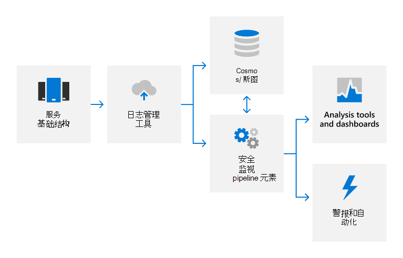

# 审核日志记录概述

## Microsoft 联机服务如何使用审核日志记录？

Microsoft 联机服务使用审核日志记录来检测未经授权的活动，并为 Microsoft 人员提供责任。 审核日志捕获有关系统配置更改和访问事件的详细信息，以及用于标识活动负责人、活动发生时间及发生位置以及活动结果的详细信息。 自动日志分析支持近实时检测可疑行为。 潜在事件会上报给相应的 Microsoft 安全响应团队，以进一步调查。

Microsoft 联机服务内部审核日志记录从各种源捕获日志数据，例如：

- 事件日志
- AppLocker 日志
- 性能数据
- System Center数据
- 呼叫详细信息记录
- 用户体验质量数据
- IIS Web 服务器日志
- SQL Server日志
- Syslog 数据
- 安全审核日志

## Microsoft 联机服务如何集中并报告审核日志？

许多不同类型的日志数据从 Microsoft 服务器上载到专有安全监视解决方案，用于近实时 (NRT) 分析和内部大数据计算服务 (Cosmos) 或 Azure 数据资源管理器 (Kusto) ，用于长期存储。 此数据传输通过 FIPS 140-2 验证的 TLS 连接在批准的端口和协议上使用自动日志管理工具进行。

日志使用基于规则、统计和机器学习方法在 NRT 中处理，以检测系统性能指标和潜在的安全事件。 机器学习模型使用传入日志数据和存储在 Cosmos 或 Kusto 中的历史记录日志数据来持续改进检测功能。 与安全相关的检测会生成警报，向呼叫工程师通知潜在事件，并触发自动修正操作（如果适用）。 除了自动安全监视之外，服务团队还使用分析工具和仪表板进行数据关联、交互式查询和数据分析。 这些报告用于监视和改进服务的整体性能。

有关安全监视和警报详细信息，请参阅 [安全监视概述](assurance-security-monitoring.md)。

## Microsoft 联机服务如何保护审核日志？

Microsoft 联机服务中用于收集和处理审核记录的工具不允许对原始审核记录内容或时间顺序进行永久或不可恢复的更改。 仅限授权人员访问存储在 Cosmos 或 Kusto 中的 Microsoft 联机服务数据。 此外，Microsoft 将审核日志的管理限制为负责审核功能的有限安全团队成员子集。 安全团队人员没有长期管理权限访问 Cosmos Kusto。 管理访问需要实时访问 (JIT) 权限审批，并且记录并审核Cosmos日志记录机制的所有更改。 审核日志的保留时间足够长，以支持事件调查和满足法规要求。 数据保留审核日志由服务团队确定;大多数审核日志数据在 Kusto 中保留 90 Cosmos 180 天。

## Microsoft 联机服务如何保护可能在审核日志中捕获的用户个人数据？

在上载日志数据之前，自动日志管理应用程序使用清理服务删除包含客户数据（如租户信息和用户个人数据）的任何字段，并使用哈希值替换这些字段。 匿名日志和哈希日志将被重写，然后上传到Cosmos。 所有日志传输都通过 FIPS 140-2 (TLS 加密连接) 。

## 认证的相关&法规

Microsoft 的在线服务会定期进行审核，以遵守外部法规和认证。 有关与审核日志记录相关的控制措施的验证，请参阅下表。

### Azure 和 Dynamics 365

| **外部审核** | **Section** | **最新报告日期** |
|:--------------------|:------------|:-----------------------|
| [ISO 27001/27002](https://servicetrust.microsoft.com/ViewPage/MSComplianceGuideV3?command=Download&downloadType=Document&downloadId=e9116047-f327-430c-a83f-166b7e561ad6&tab=7027ead0-3d6b-11e9-b9e1-290b1eb4cdeb&docTab=7027ead0-3d6b-11e9-b9e1-290b1eb4cdeb_ISO_Reports)    [适用性声明](https://servicetrust.microsoft.com/ViewPage/MSComplianceGuideV3?command=Download&downloadType=Document&downloadId=00af6c3e-7f3e-4e0d-8b0e-79f45ef2cef1&tab=7027ead0-3d6b-11e9-b9e1-290b1eb4cdeb&docTab=7027ead0-3d6b-11e9-b9e1-290b1eb4cdeb_ISO_Reports)   [认证](https://servicetrust.microsoft.com/ViewPage/MSComplianceGuideV3?command=Download&downloadType=Document&downloadId=d7af5304-3a31-40e6-9abb-e26352305d41&tab=7027ead0-3d6b-11e9-b9e1-290b1eb4cdeb&docTab=7027ead0-3d6b-11e9-b9e1-290b1eb4cdeb_ISO_Reports) | A.12.4：日志记录和监视 | 2020 年 12 月 2 日 |
| [ISO 27017](https://servicetrust.microsoft.com/ViewPage/MSComplianceGuideV3?command=Download&downloadType=Document&downloadId=e9116047-f327-430c-a83f-166b7e561ad6&tab=7027ead0-3d6b-11e9-b9e1-290b1eb4cdeb&docTab=7027ead0-3d6b-11e9-b9e1-290b1eb4cdeb_ISO_Reports)    [适用性声明](https://servicetrust.microsoft.com/ViewPage/MSComplianceGuideV3?command=Download&downloadType=Document&downloadId=a3bca0ac-867d-4204-b66b-13665f5f1e8d&tab=7027ead0-3d6b-11e9-b9e1-290b1eb4cdeb&docTab=7027ead0-3d6b-11e9-b9e1-290b1eb4cdeb_ISO_Reports)   [认证](https://servicetrust.microsoft.com/ViewPage/MSComplianceGuideV3?command=Download&downloadType=Document&downloadId=25718a8a-f34d-41e1-a95a-c49246508787&tab=7027ead0-3d6b-11e9-b9e1-290b1eb4cdeb&docTab=7027ead0-3d6b-11e9-b9e1-290b1eb4cdeb_ISO_Reports) | A.12.4：日志记录和监视 | 2020 年 12 月 2 日 |
| [ISO 27018](https://servicetrust.microsoft.com/ViewPage/MSComplianceGuideV3?command=Download&downloadType=Document&downloadId=e9116047-f327-430c-a83f-166b7e561ad6&tab=7027ead0-3d6b-11e9-b9e1-290b1eb4cdeb&docTab=7027ead0-3d6b-11e9-b9e1-290b1eb4cdeb_ISO_Reports)    [适用性声明](https://servicetrust.microsoft.com/ViewPage/MSComplianceGuideV3?command=Download&downloadType=Document&downloadId=00af6c3e-7f3e-4e0d-8b0e-79f45ef2cef1&tab=7027ead0-3d6b-11e9-b9e1-290b1eb4cdeb&docTab=7027ead0-3d6b-11e9-b9e1-290b1eb4cdeb_ISO_Reports)   [认证](https://servicetrust.microsoft.com/ViewPage/MSComplianceGuideV3?command=Download&downloadType=Document&downloadId=56904fc3-0942-4ff5-9eef-7cabc751a25c&tab=7027ead0-3d6b-11e9-b9e1-290b1eb4cdeb&docTab=7027ead0-3d6b-11e9-b9e1-290b1eb4cdeb_ISO_Reports) | A.12.4：日志记录和监视 | 2020 年 12 月 2 日 |
| [SOC 1](https://servicetrust.microsoft.com/ViewPage/MSComplianceGuideV3?command=Download&downloadType=Document&downloadId=b8721ebd-af20-42fe-b22f-8332b0a19517&tab=7027ead0-3d6b-11e9-b9e1-290b1eb4cdeb&docTab=7027ead0-3d6b-11e9-b9e1-290b1eb4cdeb_SOC_%2F_SSAE_16_Reports) | VM-1：安全事件日志记录和集合 | 2021 年 3 月 31 日 |
| [SOC 2](https://servicetrust.microsoft.com/ViewPage/MSComplianceGuideV3?command=Download&downloadType=Document&downloadId=234a0f57-83c1-4afc-a586-a0e7a59592f7&tab=7027ead0-3d6b-11e9-b9e1-290b1eb4cdeb&docTab=7027ead0-3d6b-11e9-b9e1-290b1eb4cdeb_SOC_%2F_SSAE_16_Reports) | C5-6：对日志的受限访问   VM-1：安全事件日志记录和集合 | 2021 年 3 月 31 日 |

### Office 365

| **外部审核** | **Section** | **最新报告日期** |
|:--------------------|:------------|:-----------------------|
| [FedRAMP](https://compliance.microsoft.com/compliancemanager) | AU-2：审核事件   AU-3：审核记录的内容   AU-4：审核存储容量   AU-5：审核处理失败响应   AU-6：审核审阅、分析和报告   AU-7：减少审核并生成报告   AU-8：时间戳   AU-9：保护审核信息    AU-10：不拒绝   AU-11：审核记录保留   AU-12：审核生成  | 2020 年 9 月 24 日 |
| [ISO 27001/27002/27017](https://servicetrust.microsoft.com/ViewPage/MSComplianceGuideV3?command=Download&downloadType=Document&downloadId=8d625374-4f2d-49f8-9d37-a4281ba98222&tab=7027ead0-3d6b-11e9-b9e1-290b1eb4cdeb&docTab=7027ead0-3d6b-11e9-b9e1-290b1eb4cdeb_ISO_Reports)    [适用性声明](https://servicetrust.microsoft.com/ViewPage/MSComplianceGuideV3?command=Download&downloadType=Document&downloadId=c0df4ce8-c77e-4183-84eb-c8688470d8b1&tab=7027ead0-3d6b-11e9-b9e1-290b1eb4cdeb&docTab=7027ead0-3d6b-11e9-b9e1-290b1eb4cdeb_ISO_Reports)   [认证](https://servicetrust.microsoft.com/ViewPage/MSComplianceGuideV3?command=Download&downloadType=Document&downloadId=1e84a14a-2468-45ac-9412-5e53250d57ec&tab=7027ead0-3d6b-11e9-b9e1-290b1eb4cdeb&docTab=7027ead0-3d6b-11e9-b9e1-290b1eb4cdeb_ISO_Reports) | A.12.4：日志记录和监视 | 2021 年 4 月 20 日 |
| [SOC 1](https://servicetrust.microsoft.com/ViewPage/MSComplianceGuideV3?command=Download&downloadType=Document&downloadId=90df3f9c-3aaf-4dbf-99d0-ca9f2991721b&tab=7027ead0-3d6b-11e9-b9e1-290b1eb4cdeb&docTab=7027ead0-3d6b-11e9-b9e1-290b1eb4cdeb_SOC_%2F_SSAE_16_Reports)   [SOC 2](https://servicetrust.microsoft.com/ViewPage/MSComplianceGuideV3?command=Download&downloadType=Document&downloadId=a73c1738-7892-42b7-acd3-87b6371c53f6&tab=7027ead0-3d6b-11e9-b9e1-290b1eb4cdeb&docTab=7027ead0-3d6b-11e9-b9e1-290b1eb4cdeb_SOC_%2F_SSAE_16_Reports) | CA-48：数据中心日志记录   CA-60：审核日志记录 | 2020 年 12 月 24 日 |