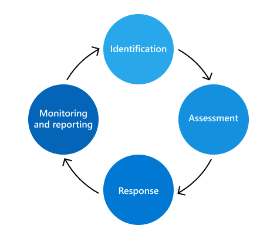

# Microsoft 365风险管理计划

风险管理计划Microsoft 365识别、评估和管理风险，以Microsoft 365。 Microsoft 的首要任务是主动识别和解决可能会影响我们的服务基础结构以及我们的客户、其数据及其信任的风险。 此外，若要履行合同义务并保持客户为满足其自己的合规性要求所依赖的公共资格鉴定，需要可靠的风险管理计划。 虽然 Microsoft 365 风险管理计划独立运行，但它与 ERM Enterprise (ERM) 策略、优先级和方法保持一致。 使用 ERM 计划，可以跨业务部门和工程组进行一致的比较，从而在企业内实现更统一的风险管理方法。

信任Microsoft 365团队负责管理 Microsoft 365 风险管理计划，以及执行 ERM 计划定义的活动。 信任团队侧重于将风险管理框架与现有的Microsoft 365、服务操作和合规性流程集成，使风险管理计划更加高效。

信任团队还维护Microsoft 365控制框架，这是一组合理控制措施，当通过支持合规性活动正确实施时，工程团队可以遵守关键法规和认证。 此框架根据作为风险管理过程的一部分的反馈和结果持续更新。

风险管理活动分为四个阶段：标识、评估、响应以及监视和报告。

## 标识

风险管理过程从识别所有关键控制区域的所有可能风险、内部和外部威胁以及安全环境中Microsoft 365开始。 指导此过程的信息来自多个来源，包括访谈、漏洞扫描、攻击模拟练习、审核结果和事件管理活动。

信任团队与来自多个服务 (的) 专家访谈，讨论服务增长时可能引入的先前确定的风险和潜在未来风险。 此外，SMES 可帮助验证从其他持续监控源识别的风险的准确性和完整性。

识别阶段也是查看之前风险评估中的决策日志、活动安全性和合规性异常以及缓解工作的情况。

## 评估

使用三个指标评估每个确定的风险：影响、可能性和控制缺陷。

- 影响是指服务、业务或 Microsoft 在意识到该风险时将发生的损害。 对 Microsoft 的影响可能包括信誉受损、客户损失或法律/合规性影响。
- Probability 定义实现潜在风险的可能性，并且通过分析其发生的概率和频率进行计算。
- 控制措施缺陷衡量已实施的缓解控制措施的有效性。

这些指标用于计算风险评分，该分数表示每个风险的严重性，并计算现有缓解策略。 风险聚合在一起，并呈现给每个服务的关键利益干系人，以验证风险Microsoft 365的准确性和完整性。

## 响应

通过使用已验证的风险列表Microsoft 365，信任团队会向受影响的服务分配风险以响应风险。 定义的准则有助于根据风险评分和控制有效性确定适当的风险响应策略。 风险响应策略分为四类：

- 容许： 低风险暴露领域，具有较低的控制级别。
- 操作：低风险暴露领域，应采取适当控制。
- 监测：高风险暴露领域，应采取适当控制，并监测其有效性。
- 改进：具有较低控制级别的高风险暴露领域是解决首要问题。

信任团队与服务团队进行协调，以制定解决每个风险的计划。 严重性级别确定每个计划的适当审阅和审批级别。 对于需要操作的风险，现有工程 Bug 流程用于跟踪、管理和做出异常决策。 使用工程团队和运营团队熟悉的流程可以使风险响应更加高效和有效。

## 监视和报告

对风险评估中确定的风险进行监控，并向相关利益干系人报告。 监视策略包括安全监视、定期风险评审、渗透测试和漏洞扫描。 这些监视工作充当报告关键绩效指标、创建仪表板和开发正式报告的数据源，所有这些报告都为将来的风险决策提供信息。

信任团队每年与每项服务的风险所有者会面，以审核风险评分、评估其行动计划的有效性，并根据需要进行更新。 此外，Microsoft 365的风险评估活动还参与 ERM 计划的 Enterprise 风险评估，为 Microsoft 高层管理人员和 ERM 计划提供了 Microsoft 风险状况的高级概述。
