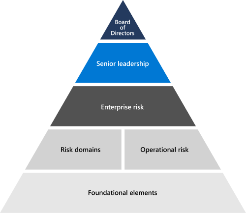

# 风险管理概述

## Microsoft 如何评估和管理整个企业的风险？

风险管理是识别、评估和应对风险的过程。 Microsoft 风险管理旨在预测新威胁，并为云系统和客户提供持续的安全性。

Microsoft 风险管理活动由企业风险管理 （ERM） 计划管理。 ERM 支持整个企业风险管理流程，并与整个企业中的管理人员合作，识别并确保对 Microsoft 最重大的风险负责。 它侧重于预测、评估和报告风险，为 Microsoft 业务策略提供信息，并实施风险缓解和问责制。

Microsoft ERM 协调整个企业的风险管理活动，使业务部门能够独立促进一致和可比较的风险评估。 这种协调使 Microsoft 能够以统一的方式聚合并报告风险信息，以用于管理。 ERM 为 Microsoft 的业务部门提供风险管理流程的常见方法、工具和目标。 Microsoft 365以及其他工程组和业务部门使用这些工具，在 ERM 指导下，在其自己的风险管理计划内执行个别风险评估。

## 如何Microsoft 365 ERM？

Microsoft 365风险管理计划遵循 ERM 指南来管理整个Microsoft 365风险。 该计划侧重于使 ERM 框架与现有的Microsoft 365、服务操作和合规性流程保持一致，使风险管理计划更加高效。 Microsoft 365的风险管理活动最终汇总到 ERM 流程并通知 ERM 流程。

作为风险评估活动的一部分，Microsoft 365风险管理计划将分析作为 Microsoft 365 Controls Framework () 的一部分实现的控制措施的设计) 。 框架是一组经过合理调整的控制措施，当正确实施控制措施和支持合规性活动时，工程团队可以遵守关键法规和认证。

## 如何Microsoft 365其在线服务中的风险？

作为正在进行的风险评估活动的一部分，Microsoft 365风险管理计划与设计、构建和运行 Microsoft 365 服务的服务团队进行访谈，以确定当前的风险和关注领域。 这些活动以及持续监控数据、审核和其他来源的分析，用于制定风险评估报告，以确定长期业务目标的当前和可能未来风险。 风险评估报告根据我们Microsoft 365团队的发现和反馈，全面概述了Microsoft 365情况。 与其他业务部门的类似报告一起，Microsoft 365 风险评估报告有助于 ERM 计划的风险评估，并为其提供信息。

Microsoft 365信任是一个组，负责支持与策略合规性、安全要求和风险管理相关的保证操作。 Microsoft 365 Trust 致力于识别出现的新风险并监控已知风险和风险响应。 来自服务Microsoft 365团队的反馈以及来自环境环境的持续Microsoft 365可告知此过程。 跟踪风险应对的成败，以对风险可能性和影响进行分析并提供相关信息。 与风险所有者定期举行风险评审会议Microsoft 365信任以更新和管理风险响应。

## 认证的相关&法规

Microsoft 的在线服务会定期进行审核，以遵守外部法规和认证。 有关与风险管理相关的控制措施的验证，请参阅下表。

| **外部审核** | **Section** | **最新报告日期** |
|:--------------------|:------------|:-----------------------|
| [FedRAMP (Office 365) ](https://compliance.microsoft.com/compliancemanager) | CA-2：安全评估   CA-5：计划行动和里程碑   RA-3：风险评估 | 2020 年 9 月 24 日 |
| [ISO 27001/27002 (Office 365) ](https://servicetrust.microsoft.com/ViewPage/MSComplianceGuideV3?command=Download&downloadType=Document&downloadId=8d625374-4f2d-49f8-9d37-a4281ba98222&tab=7027ead0-3d6b-11e9-b9e1-290b1eb4cdeb&docTab=7027ead0-3d6b-11e9-b9e1-290b1eb4cdeb_ISO_Reports)    [适用性声明](https://servicetrust.microsoft.com/ViewPage/MSComplianceGuideV3?command=Download&downloadType=Document&downloadId=c0df4ce8-c77e-4183-84eb-c8688470d8b1&tab=7027ead0-3d6b-11e9-b9e1-290b1eb4cdeb&docTab=7027ead0-3d6b-11e9-b9e1-290b1eb4cdeb_ISO_Reports)   [认证](https://servicetrust.microsoft.com/ViewPage/MSComplianceGuideV3?command=Download&downloadType=Document&downloadId=1e84a14a-2468-45ac-9412-5e53250d57ec&tab=7027ead0-3d6b-11e9-b9e1-290b1eb4cdeb&docTab=7027ead0-3d6b-11e9-b9e1-290b1eb4cdeb_ISO_Reports) | A.5：信息安全策略 | 2021 年 4 月 20 日 |
| [ISO 27017 (Office 365) ](https://servicetrust.microsoft.com/ViewPage/MSComplianceGuideV3?command=Download&downloadType=Document&downloadId=8d625374-4f2d-49f8-9d37-a4281ba98222&tab=7027ead0-3d6b-11e9-b9e1-290b1eb4cdeb&docTab=7027ead0-3d6b-11e9-b9e1-290b1eb4cdeb_ISO_Reports)    [适用性声明](https://servicetrust.microsoft.com/ViewPage/MSComplianceGuideV3?command=Download&downloadType=Document&downloadId=c0df4ce8-c77e-4183-84eb-c8688470d8b1&tab=7027ead0-3d6b-11e9-b9e1-290b1eb4cdeb&docTab=7027ead0-3d6b-11e9-b9e1-290b1eb4cdeb_ISO_Reports)   [认证](https://servicetrust.microsoft.com/ViewPage/MSComplianceGuideV3?command=Download&downloadType=Document&downloadId=70de0999-5451-43a3-9ef4-761e8fbfb1a3&tab=7027ead0-3d6b-11e9-b9e1-290b1eb4cdeb&docTab=7027ead0-3d6b-11e9-b9e1-290b1eb4cdeb_ISO_Reports) | A.5：信息安全策略 | 2021 年 4 月 20 日 |
| [SOC 1 (Office 365)](https://servicetrust.microsoft.com/ViewPage/MSComplianceGuideV3?command=Download&downloadType=Document&downloadId=90df3f9c-3aaf-4dbf-99d0-ca9f2991721b&tab=7027ead0-3d6b-11e9-b9e1-290b1eb4cdeb&docTab=7027ead0-3d6b-11e9-b9e1-290b1eb4cdeb_SOC_%2F_SSAE_16_Reports) | CA-03：风险管理 | 2020 年 12 月 24 日 |
| [SOC 2 (Office 365) ](https://servicetrust.microsoft.com/ViewPage/MSComplianceGuideV3?command=Download&downloadType=Document&downloadId=a73c1738-7892-42b7-acd3-87b6371c53f6&tab=7027ead0-3d6b-11e9-b9e1-290b1eb4cdeb&docTab=7027ead0-3d6b-11e9-b9e1-290b1eb4cdeb_SOC_%2F_SSAE_16_Reports) | CA-02：治理、风险和合规性团队的职责   CA-03：风险管理   CA-17：Microsoft 安全策略   CA-24：内部风险评估 | 2020 年 12 月 24 日 |
