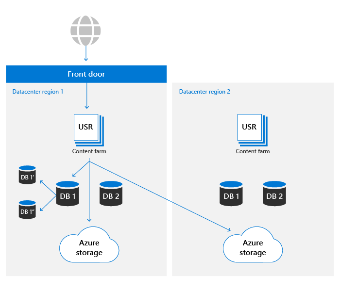
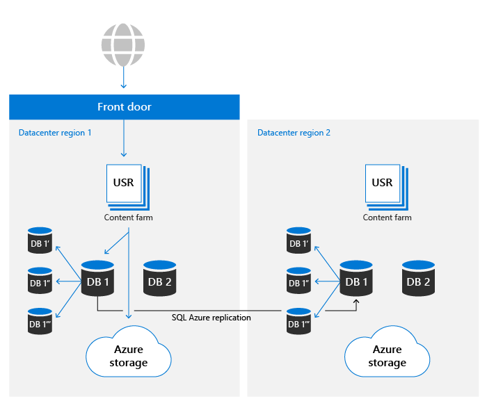

# Microsoft 365中的SharePoint和OneDrive数据恢复能力

在 Microsoft 365 中，OneDrive 基于 SharePoint 文件平台构建。 本文仅将 SharePoint 用于引用这两种产品。 本文的内容与 Microsoft 365 相关，不适用于消费者服务。

SharePoint 的核心内容存储包含两种主要资产：

- **元数据**：有关每个文件的元数据存储在 Azure SQL 数据库中。 Azure SQL提供了 SharePoint 使用的完整业务连续性情景，本文稍后将介绍详细信息。
- **Blob 存储**：上传到 SharePoint 的用户内容存储在 Azure 存储中。 SharePoint 已基于 Azure 存储构建了一个自定义复原计划，以确保几乎实时复制用户内容和真正处于活动状态/活动的系统。

用于确保数据恢复的完整控件集在更多部分中进行了说明。

## Blob 存储恢复

SharePoint 具有一个自定义解决方案，用于存储 Azure 存储中的客户数据。 每个文件同时写入主和辅助数据中心区域。 如果写入任一 Azure 区域失败，文件保存将失败。 将内容写入 Azure 存储后，校验和会与元数据分开存储，并用于确保所有未来读取过程中提交写入的内容与发送到 SharePoint 的原始文件相同。 在所有工作流中使用相同的技术，以防止应发生任何损坏的传播。 在每个区域内，Azure 本地冗余存储 (LRS) 提供了高级别的可靠性。 有关详细信息， [请参阅 Azure 存储冗余](/azure/storage/common/storage-redundancy-lrs) 文章。

SharePoint 使用Append-Only存储。 此过程可确保在初始保存后文件不会更改或损坏，但通过使用产品内版本控制，可以检索任何以前版本的文件内容。

任一数据中心中的 SharePoint 环境都可以访问两个 Azure 区域的存储容器。 出于性能原因，始终首选同一本地数据中心中的存储容器，但是，未在所需阈值内查看结果的读取请求将具有从远程数据中心请求的相同内容，以确保数据始终可用。

## 元数据恢复

SharePoint 元数据对于访问用户内容也至关重要，因为它存储 Azure 存储中存储的内容的位置和访问密钥。 这些数据库存储在 Azure SQL，其中具有广泛的 [业务连续性计划](/azure/sql-database/sql-database-business-continuity)。

SharePoint 使用 Azure SQL 提供的复制模型，并构建了专有自动化技术，以确定需要故障转移并在必要时启动操作。 因此，从 Azure 和 Azure 的角度看，它属于"手动数据库SQL类别。 Azure 数据库可恢复SQL的最新指标在此处 [提供](/azure/azure-sql/database/business-continuity-high-availability-disaster-recover-hadr-overview#recover-a-database-to-the-existing-server)。

SharePoint 使用 Azure SQL 备份系统在 PITR (时间点还原) 最多 14 天。 将稍后部分对 PITR [进行更多介绍。](#deletion-backup-and-point-in-time-restore)

## 自动故障转移

当发生特定于位置的事件时，SharePoint 使用自定义的自动化故障转移来最大程度地降低对客户体验的影响。 监控驱动的自动化检测超出特定阈值的单组件或多组件故障将导致所有用户的活动从有问题的环境中自动重定向到温辅助环境。 故障转移会导致元数据和计算存储完全从新数据中心提供。 由于 blob 存储始终完全处于活动状态/处于活动状态，因此故障转移不需要任何更改。 计算层将首选最近的 blob 容器，但将随时使用本地和远程 blob 存储位置以确保可用性。

SharePoint 使用 Azure Front Door 服务提供到 Microsoft 网络内部的路由。 此配置允许独立于 DNS 的故障转移重定向，并减少本地计算机缓存的影响。 大多数故障转移操作对最终用户都是透明的。 如果存在故障转移，则客户无需进行任何更改，即维护对服务的访问权限。

## 版本控制与文件还原

对于新创建的文档库，SharePoint 默认针对每个文件使用 500 个版本，并可以配置为保留更多版本（如果需要）。 UI 不允许设置少于 100 个版本的值，但可以设置系统以使用公用 API 存储较少的版本。 为了可靠性，不建议使用小于 100 的任何值，这可能会导致用户活动导致意外的数据丢失。

有关版本控制详细信息，请参阅 [SharePoint 中的版本控制](/microsoft-365/community/versioning-basics-best-practices)。

文件还原是一种功能，在 SharePoint 文档库任何时间恢复为过去 30 天内的任何时间。 此过程可用于从勒索软件、批量删除、损坏或其他任何事件恢复。 此功能使用文件版本，因此减少默认版本会降低此还原的有效性。

OneDrive 和[SharePoint](https://support.office.com/article/Restore-a-document-library-317791c3-8bd0-4dfd-8254-3ca90883d39a)记录了文件还原功能。

## 删除、备份和时间点还原

从 SharePoint 中删除的用户内容将经过以下删除流。

已删除的项目在回收站中保留一段时间。 对于 SharePoint，保留时间为 93 天。 从项目的原始位置删除项目时，它将开始。 当您从网站回收站中删除项目时，它会进入 [网站集回收站](https://support.office.com/article/restore-deleted-items-from-the-site-collection-recycle-bin-5fa924ee-16d7-487b-9a0a-021b9062d14b)。 它将在剩余的 93 天内保留，然后永久删除。 有关如何使用回收站的信息，请参阅以下链接：

- [还原回收站中的项目](https://support.office.com/article/Restore-items-in-the-Recycle-Bin-of-a-SharePoint-site-6df466b6-55f2-4898-8d6e-c0dff851a0be)
- [从网站集回收站还原已删除的项目](https://support.office.com/article/Restore-deleted-items-from-the-site-collection-recycle-bin-5fa924ee-16d7-487b-9a0a-021b9062d14b)。

此过程是默认删除流，不会考虑保留策略或标签。 有关详细信息，请参阅了解 [SharePoint 和 OneDrive 的保留](/microsoft-365/compliance/retention-policies-sharepoint)。

完成 93 天的回收管道后，将针对元数据和 Blob 存储独立执行删除。 将立即从数据库中删除元数据，这使得内容不可读，除非从备份中还原元数据。 SharePoint 维护了 14 天的元数据备份。 根据此发布时的文档，这些备份以近实时状态本地进行，然后推送到冗余 Azure 存储容器中的存储，计划为 5-10 分钟。

删除 Blob 存储内容时，SharePoint 会利用 Azure Blob 存储的软删除功能防止意外或恶意删除。 使用此功能，我们总共有 14 天的时间在内容被永久删除之前还原内容。

>[!Note]
>虽然 Microsoft 应用程序将内容发送到标准进程的回收站，但 SharePoint 确实提供了允许跳过回收站并强制立即删除的 API。 检查应用程序以确保仅在出于合规性原因需要时完成此操作。

## 完整性检查

SharePoint 使用各种方法来确保数据生命周期所有阶段 blob 和元数据的完整性：

- **存储在元数据中的** 文件哈希：整个文件的哈希与文件元数据一起存储，以确保在所有操作过程中保持文档级别数据完整性
- **存储在元数据中的 Blob** 哈希：每个 blob 项存储加密内容的哈希，以防范基础 Azure 存储中的损坏。
- **数据完整性作业**：每 14 天，通过列出数据库中的项目，并匹配 Azure 存储中所列 blob 来扫描每个网站的完整性。 作业报告任何缺少存储 blob 的 blob 引用，并在需要时通过 Azure 存储 [软删除](/azure/storage/blobs/soft-delete-blob-overview) 功能检索这些 blob。
