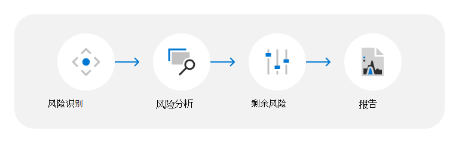

# 数据中心威胁、漏洞和风险评估

Microsoft 全天候为客户提供 200 多项云服务。 示例包括企业服务，如 Microsoft Azure、Microsoft Office 365、Microsoft Dynamics 和消费者服务（如必应、MSN、Outlook.com、Skype 和 Xbox Live）。 这些服务托管在 Microsoft 的云基础结构中：全球分布式数据中心、边缘计算节点和服务运营中心，以及全球最大的网络之一;具有广泛的光纤占用空间，将它们全部连接在一起。 自 1989 年第一个数据中心开始运营以来，Microsoft 已经在基础结构上投入了数十亿美元，并始终关注提供可靠、可伸缩和安全增强的在线服务，同时随着业务的增长有效地管理运营和成本。

Microsoft 云服务建立在信任和安全的基础之上，优先考虑使用最先进的技术、流程和加密，来保护云中的客户数据和应用程序。 客户数据存储在 Microsoft 数据中心，这些数据中心分布在不同的地理位置，并受到严密的逻辑和物理安全措施保护。 Microsoft 数据中心在设计和运营上旨在防止服务和数据因自然灾害、环境威胁或未经授权的访问而受损。

## 威胁、漏洞和风险评估方法

TVRA) 威胁、漏洞 (风险评估计划可帮助你了解 Microsoft 如何识别和缓解物理和环境威胁对 Microsoft 数据中心的影响。 Microsoft 致力于不断更新其风险评估和方法，以便改进并随着条件的变化。 因此，TVRA 分析和结论可能会发生变化，报告将被视为时间点。

Microsoft 按照以下步骤来促进 TVRA 流程：

### 风险标识

TVRA 考虑由自然和人为制造威胁引发的各种威胁 (包括意外) 危险。 结果将因数据中心位置、设计、服务范围和其他因素而异。 TVRA 根据客户要求、第三方和第一方风险信息提供的风险环境的独立国家/地区、市/县和网站级别评估，选择要在 TVRA 文档中突出显示的威胁方案。 对于具有多个数据中心的区域，将汇总 TVRA 评级，以确保全面了解所评估位置的物理和环境威胁、漏洞和风险。

适用于数据中心 TVRA 评估的威胁情形类型包括：

- **外部威胁**：外部有意或意外的人为活动导致的事件。 例如，内乱、恐怖主义、犯罪活动、外部盗窃、简易爆炸装置、武装袭击、纵火、未经授权的进入和飞机失事。
- **内部威胁**：由内部有意或意外的人为活动导致的事件。 例如，内部盗窃和破坏。
- **自然危害**：可能对数据中心造成负面影响的自然过程或危害。 例如，热带风暴、旋风、洪水、山体滑坡、干旱、野火、地震、火山活动、伴有雷电的暴风雨、冰雹、强风或大雨。
- **环境威胁**：可能对数据中心造成负面影响的环境条件。 例如，水压力、热压力和流行病。

### 风险分析

根据对威胁固有风险的评估评估威胁;固有风险计算为威胁的固有影响的函数，以及威胁在缺少管理操作和控制的情况下发生威胁的固有可能性的函数。 这些评估由内部主题专家 (SME) 反馈，并使用外部风险索引进行通知。

### 剩余风险

在考虑了控制有效性之后，将剩余风险确定为剩余风险级别的度量。 控制有效性是对当前旨在防止或检测威胁的管理和控制措施的度量，以及对设计和实施的控制措施将发挥其预期效果的可能性的评估。 可通过内部 SME 对 TVRA 中注明的数据中心位置的控制措施有效性的累积反馈来了解这些评估。

### 报告

评估完成后，将生成 TVRA 报告以用于管理审批和支持与风险管理相关的总体工作。

## 资源

- [Azure 全局基础结构](https://www.microsoft.com/datacenters)
